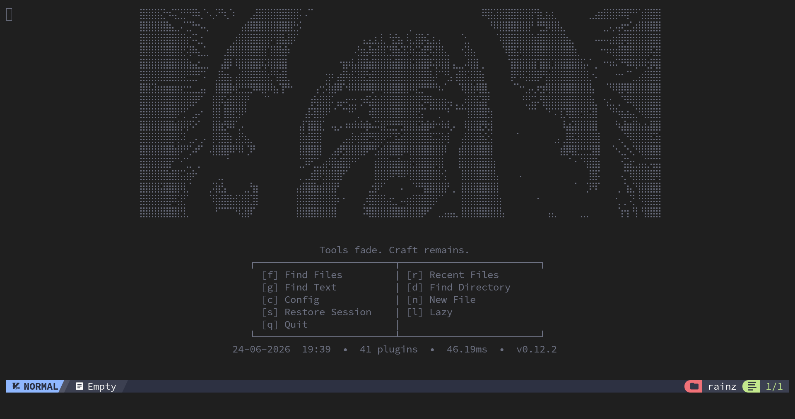
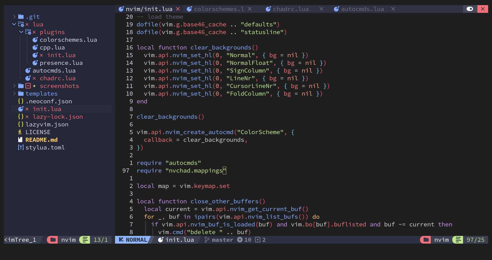

# neovim-conf

Personal Neovim configuration built on [NvChad v2.5](https://github.com/NvChad/NvChad).

## Screenshots




## Structure

```
init.lua              — Entry point, options, mappings, lazy bootstrap, transparency
lua/
├── autocmds.lua      — Loads NvChad's autocmds (FilePost event for LSP)
├── chadrc.lua        — NvChad theme config (palenight)
└── plugins/
    ├── init.lua      — All plugin specs (alpha, lspconfig, conform, telescope, etc.)
    ├── cpp.lua       — C/C++ LSP (clangd) + mason-lspconfig
    ├── colorschemes.lua — All available themes
    └── presence.lua  — Discord Rich Presence
screenshots/
├── main-dashboard.png
└── main-sample.png
```

## Features

- **Alpha dashboard** — Custom startup dashboard with random ASCII art header, rotating quotes, and a command grid (find files, find text, find directory, config, restore session, new file, lazy, quit)
- **LSP**: gopls (Go), clangd (C/C++), vtsls (TypeScript/JavaScript), html, cssls, jsonls, yamlls, marksman, bashls, dockerls, pyright, rust_analyzer, prismals, emmet_language_server via `nvim-lspconfig`
- **Formatting**: conform.nvim with prettier, gofumpt, clang-format, stylua, goimports
- **Completion**: blink.cmp (NvChad's native completion)
- **Treesitter**: syntax highlighting for all major languages
- **File explorer**: NvimTree
- **Telescope**: fuzzy finding, live grep, buffers, help tags, recent files, directories — all with a custom centered dropdown theme
- **Session management**: auto-session (auto-save/restore) + persistence.nvim (manual restore from dashboard)
- **Terminal**: toggleterm.nvim (horizontal, vertical, float)
- **Flash**: quick jump and treesitter navigation with `s` / `S`
- **Which-key**: popup keybinding hints
- **Themes**: 10+ colorschemes (tokyonight, catppuccin, gruvbox-material, kanagawa, rose-pine, onedark, solarized-osaka, etc.)
- **Clipboard**: explicit `xsel` provider for reliable Wayland clipboard support
- **Transparency**: clears background highlights so terminal transparency shows through (works with Ghostty, Kitty, Alacritty, etc.)

## Theme

Default theme is `palenight` (set in `lua/chadrc.lua`). Switch with `:Telescope themes`.

## Keymaps

### Dashboard (alpha)

| Key | Action |
|-----|--------|
| `f` | Find Files |
| `r` | Recent Files |
| `g` | Live Grep |
| `d` | Find Directory |
| `s` | Restore Session |
| `c` | Open Config |
| `n` | New File |
| `l` | Lazy |
| `q` | Quit |

### General

| Key | Action |
|-----|--------|
| `<Tab>` / `<S-Tab>` | Next/previous buffer |
| `<C-x>` | Close buffer |
| `<leader>X` | Force close buffer |
| `<leader>bo` | Close other buffers |
| `<C-h/j/k/l>` | Navigation between panes |
| `<leader>w/` | Split vertical |
| `<leader>w-` | Split horizontal |
| `<leader>ww` | Next window |
| `<leader>wx` | Close window |
| `<leader>tx` | Close tab |
| `<leader>qq/qQ/qa/qA` | Quit variants |

### Telescope

| Key | Action |
|-----|--------|
| `<leader>e` | Find Files (float) |
| `<leader>ff` | Find Files (cwd) |
| `<leader>fp` | Find Plugin File |
| `<leader>fA` | Find Files (home) |
| `<leader>fg` | Live Grep |
| `<leader>fb` | Buffers |
| `<leader>fh` | Help Tags |
| `<leader>fr` | Recent Files |

### LSP

| Key | Action |
|-----|--------|
| `gd` | Go to definition |
| `gD` | Go to declaration |
| `gr` | References |
| `gi` | Go to implementation |
| `K` | Hover documentation |
| `<leader>ca` | Code action |
| `<leader>rn` | Rename symbol |
| `<leader>D` | Type definition |
| `<leader>fs` | Document symbols |
| `<leader>ws` | Workspace symbols |

### Diagnostics

| Key | Action |
|-----|--------|
| `<leader>d` | Line diagnostics |
| `[d` / `]d` | Previous/next diagnostic |
| `<leader>dl` | Diagnostics to loclist |

### Terminal

| Key | Action |
|-----|--------|
| `<leader>tt` | Terminal (horizontal) |
| `<leader>tv` | Terminal (vertical) |
| `<leader>tf` | Terminal (float) |

### Other

| Key | Action |
|-----|--------|
| `s` / `S` | Flash jump / Treesitter |
| `<leader>cf` | Format buffer |
| `;` | Enter command mode |
| `jk` | Escape (insert mode) |

## Requirements

- Neovim >= 0.12.0
- Nerd Font
- Git
- Go (for gopls)
- Clangd (for C/C++, install via Mason)
- `xsel` or `wl-clipboard` (for clipboard on Linux/Wayland)

## Install

```sh
git clone git@github.com:R7rainz/neovim-conf.git ~/.config/nvim
nvim --headless "+Lazy! sync" +qa
```
